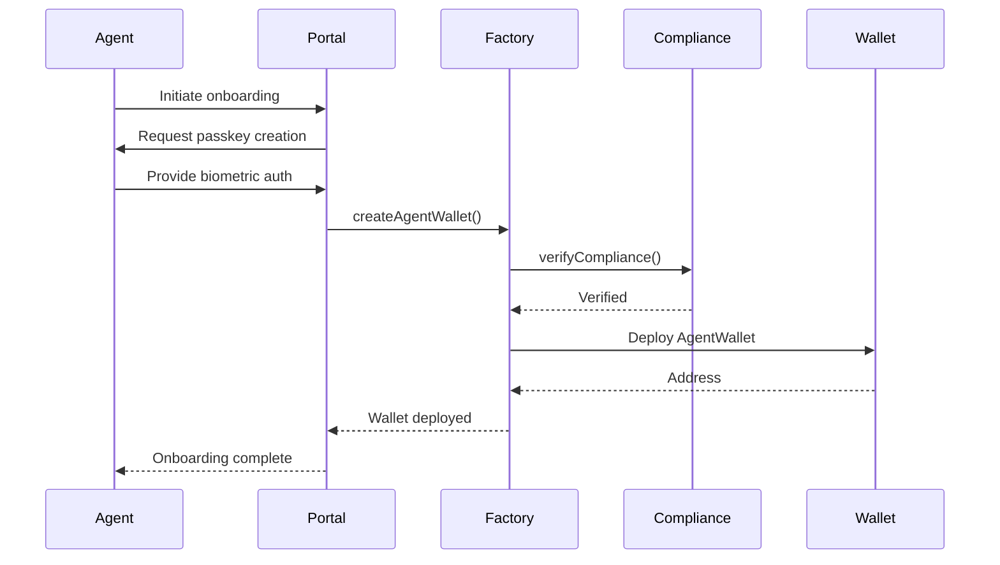
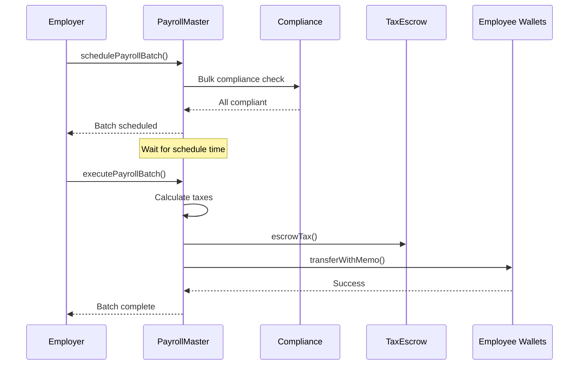
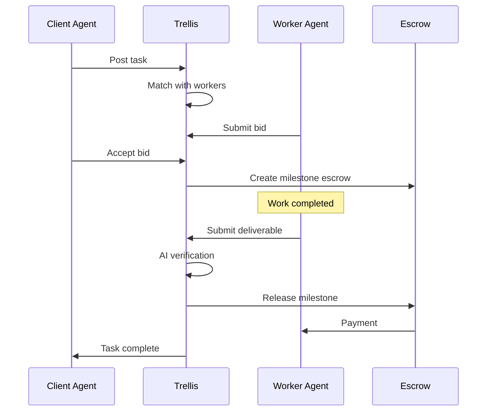

# Trellis Technical Documentation

## Table of Contents
1. [Architecture Overview](#architecture-overview)
2. [Smart Contracts](#smart-contracts)
3. [User Flows](#user-flows)
4. [Tempo Features Integration](#tempo-features-integration)
5. [Security Considerations](#security-considerations)
6. [Deployment Guide](#deployment-guide)

---

## Architecture Overview

### System Components

```
┌─────────────────────────────────────────────────────────────────┐
│                         CLIENT LAYER                             │
│  ┌─────────────┐  ┌─────────────┐  ┌─────────────────────────┐  │
│  │ Web Portal  │  │ Mobile App  │  │ Agent SDK               │  │
│  │ (React)     │  │ (React Nat.)│  │ (Node.js/Python)        │  │
│  └─────────────┘  └─────────────┘  └─────────────────────────┘  │
└─────────────────────────────────────────────────────────────────┘
                              │
┌─────────────────────────────────────────────────────────────────┐
│                      SMART CONTRACT LAYER                        │
│  ┌──────────────┐ ┌──────────────┐ ┌──────────────────────────┐ │
│  │ AgentWallet  │ │ PayrollMaster│ │ ComplianceRegistry       │ │
│  │ Factory      │ │              │ │ (TIP-403 Integration)    │ │
│  └──────────────┘ └──────────────┘ └──────────────────────────┘ │
│  ┌──────────────┐ ┌──────────────┐                               │
│  │ TaxEscrow    │ │ Employment   │                               │
│  │ Manager      │ │ Contract     │                               │
│  └──────────────┘ └──────────────┘                               │
└─────────────────────────────────────────────────────────────────┘
                              │
┌─────────────────────────────────────────────────────────────────┐
│                      TEMPO BLOCKCHAIN                            │
│  ┌──────────────┐ ┌──────────────┐ ┌──────────────────────────┐ │
│  │ TIP-20       │ │ TIP-403      │ │ Native Transactions      │ │
│  │ Tokens       │ │ Policies     │ │ (Batch/Schedule/Passkey) │ │
│  └──────────────┘ └──────────────┘ └──────────────────────────┘ │
└─────────────────────────────────────────────────────────────────┘
```

---

## Smart Contracts

### 1. AgentWalletFactory

**Purpose:** Deploy and manage agent wallets with embedded compliance

**Key Functions:**
```solidity
function createAgentWallet(
    string calldata _agentId,
    string calldata _jurisdiction,
    bytes32 _passkeyPublicKey,
    AgentType _agentType
) external returns (address walletAddress);

function getAgentProfile(address _walletAddress) 
    external view returns (AgentProfile memory);
```

**Events:**
```solidity
event AgentWalletCreated(
    address indexed walletAddress,
    string indexed agentId,
    AgentType agentType,
    string jurisdiction,
    uint256 timestamp
);
```

**Features:**
- Passkey-based authentication
- Role-based access control
- Compliance integration
- Multi-agent type support (Human, AI, Hybrid)

---

### 2. PayrollMaster

**Purpose:** Core payroll logic with batching and scheduling

**Key Functions:**
```solidity
function addEmployee(
    address _employeeWallet,
    string calldata _employeeId,
    uint256 _annualSalary,
    uint256 _taxRate,
    string calldata _jurisdiction,
    uint256 _paymentFrequency
) external;

function schedulePayrollBatch(
    uint256[] calldata _employeeIndices,
    uint256 _scheduledTime
) external returns (bytes32 batchId);

function executePayrollBatch(
    bytes32 _batchId,
    uint256[] calldata _employeeIndices
) external;
```

**Key Features:**
- Batch payments (atomic execution)
- Scheduled payroll runs
- Automatic tax calculation
- Multi-jurisdiction support
- 2D nonce parallelization

---

### 3. ComplianceRegistry

**Purpose:** KYC/AML verification and policy enforcement

**Key Functions:**
```solidity
function verifyCompliance(
    address _walletAddress,
    string calldata _jurisdiction,
    RiskLevel _riskLevel,
    string calldata _kycProvider,
    bytes32 _verificationHash
) external;

function canReceivePayments(
    address _walletAddress,
    string calldata _jurisdiction
) external view returns (bool canReceive, string memory reason);

function checkTransactionAllowed(
    address _from,
    address _to
) external view returns (bool allowed);
```

**Features:**
- TIP-403 policy integration
- Whitelist/blacklist management
- Real-time transaction screening
- Risk-based compliance
- Audit trail generation

---

### 4. TaxEscrowManager

**Purpose:** Manage tax withholdings and remittances

**Key Functions:**
```solidity
function escrowTax(
    string calldata _jurisdiction,
    uint256 _amount
) external payable;

function remitTaxes(string calldata _jurisdiction) external;

function generateTaxForm(
    address _employer,
    string calldata _jurisdiction,
    string calldata _formType,
    uint256 _year
) external view returns (uint256 totalTax, uint256 recordCount);
```

**Features:**
- Automatic withholding
- Jurisdiction-specific escrow
- Tax form generation
- Periodic remittance

---

## User Flows

### Flow 1: Agent Onboarding



**Steps:**
1. Agent initiates onboarding
2. Passkey creation via WebAuthn
3. Wallet deployment via factory
4. KYC/AML verification
5. Compliance record creation
6. Wallet activation

---

### Flow 2: Payroll Execution



**Steps:**
1. Employer schedules batch
2. Compliance pre-check
3. Wait for execution time
4. Calculate withholdings
5. Escrow taxes
6. Disburse net salaries
7. Record transactions

---

### Flow 3: Agent Task Marketplace



---

## Tempo Features Integration

### 1. TIP-20 Token Standard

**Usage:** All payments use TIP-20 stablecoins

**Features Leveraged:**
- `transferWithMemo()` - Payment references
- RBAC - Role management
- Payment lanes - Predictable fees
- Fee sponsorship - Employer-paid gas

**Example:**
```solidity
// Payment with employee ID memo
bytes32 memo = keccak256(abi.encodePacked(employeeId, period));
tip20Token.transferWithMemo(employeeWallet, netAmount, memo);
```

---

### 2. TIP-403 Policy Registry

**Usage:** Compliance enforcement

**Integration:**
```solidity
// Check before payment
(bool canReceive, string memory reason) = complianceRegistry
    .canReceivePayments(employeeWallet, jurisdiction);

require(canReceive, reason);
```

**Policies:**
- Whitelist/blacklist
- KYC requirements
- Jurisdiction restrictions
- Risk level checks

---

### 3. Native Transactions

**Features Used:**

#### Batched Payments
```javascript
// Single transaction, multiple payments
const batchTx = await payrollMaster.executePayrollBatch(
    batchId,
    employeeIndices,
    { 
        type: 2, // EIP-1559 on Tempo
        batch: true // Enable batching
    }
);
```

#### Scheduled Payments
```javascript
// Protocol-level scheduling
const scheduleTime = Math.floor(Date.now() / 1000) + 86400; // 24h
await payrollMaster.schedulePayrollBatch(
    employeeIndices,
    scheduleTime
);
```

#### Passkey Authentication
```javascript
// WebAuthn signatures
const signature = await navigator.credentials.get({
    publicKey: {
        challenge: challenge,
        allowCredentials: [{
            id: credentialId,
            type: 'public-key'
        }]
    }
});
```

---

### 4. Payment Lanes

**Benefits:**
- Reserved blockspace
- Predictable fees (<$0.001)
- No gas wars
- Priority execution

**Implementation:**
```solidity
// Payment lane specified in transaction
struct TempoTransaction {
    uint256 paymentLane; // Set to PAYMENT_LANE_ID
    bytes data;
    // ... other fields
}
```

---

### 5. 2D Nonces

**Usage:** Parallel payroll execution

```solidity
// Different nonce channels for parallel execution
uint256 channel1Nonce = 0;
uint256 channel2Nonce = 0;

// Execute simultaneously
executePayroll(channel1Employees, channel1Nonce);
executePayroll(channel2Employees, channel2Nonce);
```

---

## Security Considerations

### 1. Smart Contract Security

**Measures:**
- Reentrancy guards
- Access control modifiers
- Input validation
- Integer overflow protection
- Emergency pause functionality

**Audit Status:**
- Internal review complete
- External audit scheduled
- Bug bounty program planned

---

### 2. Compliance Security

**Features:**
- Immutable audit logs
- Real-time sanctions screening
- Multi-sig for policy changes
- Time-locked upgrades

---

### 3. Passkey Security

**Implementation:**
- WebAuthn standard compliance
- Domain-bound credentials
- Hardware-backed keys
- Biometric authentication

---

## Deployment Guide

### Prerequisites

```bash
# Node.js v18+
node --version

# Install dependencies
npm install

# Set up environment
cp .env.example .env
# Edit .env with your credentials
```

### Deploy to Tempo Testnet

```bash
# Compile contracts
npx hardhat compile

# Deploy
npx hardhat run scripts/deploy.js --network moderato

# Verify (optional)
npx hardhat verify --network moderato CONTRACT_ADDRESS
```

### Run Simulations

```bash
# Individual workflows
npm run simulate:onboarding
npm run simulate:payroll
npm run simulate:compliance
npm run simulate:tasks

# Full integration
npm run simulate:full
```

---

## API Reference

### AgentWalletFactory

```javascript
// Create agent wallet
const tx = await factory.createAgentWallet(
    "AGENT-001",           // agentId
    "US",                  // jurisdiction
    passkeyPublicKey,      // bytes32
    1                      // AI_AGENT type
);

// Get agent profile
const profile = await factory.getAgentProfile(walletAddress);
```

### PayrollMaster

```javascript
// Add employee
await payroll.addEmployee(
    employeeWallet,
    "EMP-001",
    ethers.parseUnits("120000", 6), // $120k annual
    2500,                           // 25% tax rate
    "US",
    30 * 24 * 60 * 60              // Monthly
);

// Schedule batch
const batchId = await payroll.schedulePayrollBatch(
    [0, 1, 2, 3],              // Employee indices
    Math.floor(Date.now() / 1000) + 86400  // 24h from now
);

// Execute batch
await payroll.executePayrollBatch(batchId, [0, 1, 2, 3]);
```

### ComplianceRegistry

```javascript
// Verify agent
await compliance.verifyCompliance(
    walletAddress,
    "US",
    0,                              // LOW risk
    "Trellis-KYC",
    verificationHash
);

// Check compliance
const [canReceive, reason] = await compliance.canReceivePayments(
    walletAddress,
    "US"
);
```

---

## Performance Metrics

### Gas Costs (estimated)

| Operation | Gas | Cost (USD) |
|-----------|-----|------------|
| Deploy Factory | 2,500,000 | ~$0.50 |
| Create Agent Wallet | 350,000 | ~$0.07 |
| Add Employee | 85,000 | ~$0.02 |
| Schedule Batch | 45,000 | ~$0.01 |
| Execute Batch (per payment) | 25,000 | ~$0.005 |
| Compliance Check | 15,000 | ~$0.003 |

### Throughput

- **Parallel Payments:** 1,000+ per block
- **Settlement Time:** < 1 second
- **Finality:** Instant (Simplex BFT)

---

## Troubleshooting

### Common Issues

**1. "Insufficient balance for gas"**
- Ensure you have PATHUSD for fees
- Check fee sponsorship is configured

**2. "Compliance check failed"**
- Verify KYC status
- Check jurisdiction policies
- Review risk level

**3. "Batch execution failed"**
- Check all employees are compliant
- Verify employer has sufficient balance
- Ensure scheduled time has passed

---

## Support

- 📧 Email: dev@trellis.io
- 💬 Discord: discord.gg/trellis
- 🐦 Twitter: @TrellisPayroll
- 📚 Docs: docs.trellis.io

---

## Contributing

We welcome contributions! Please see [CONTRIBUTING.md](CONTRIBUTING.md) for guidelines.

---

**Last Updated:** February 2025  
**Version:** 1.0.0  
**License:** MIT
